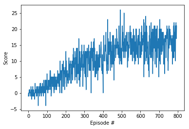

# Project 1: Navigation

The purpose of the project is to train an agent to collect yellow bananas while avoiding blue bananas. The environment is considered solved when the agent reaches average score of 13+ on 100 consecutive episodes.


### Actions:

The environment has the following 4 discrete values for the actions:

- **`0`** - Forward.
- **`1`** - Backward.
- **`2`** - Left.
- **`3`** - Right.

### State

The state space has 37 dimensions and contains the agent's velocity, along with ray-based perception of objects around agent's forward direction.

### Reward

The agent should receive reward of +1 for each yellow banana and -1 one for blue

## Learning Algorithm

I used Double Q-Learning which was introduced by Deep Mind paper "[Deep Reinforcement Learning with Double Q-learning](https://arxiv.org/pdf/1509.06461.pdf")" as an improvement to there original algorithm Deep Q-Learning (DQN) introduced by "[Human-level control through deep reinforcement learning](https://storage.googleapis.com/deepmind-media/dqn/DQNNaturePaper.pdf")"

The algorithm use neural network to approximate action value function in temporal difference Q-Learning. The implementation include the improvement suggest by deep mind paper to stabilise training, Memory replay and the of an iterative update that adjusts the action-values (Q) towards target values that are only periodically updated.

## Q network

The  neural network consist of 2  layers with nonlinear activation function and one linear layer:

1. Fully connected layer with 37 units (The size of the state)
2. Relu activation function
3. Fully connected layer with 64 units
4. Relu activation function
5. Fully connected layer with 4 units (Size of the action)

And for optimisation the neural network uses MSE lose function.

## Hyper-parameters

- Buffer size       = 100000.0
- Gamma             = 0.995
- Tau (Soft update) = 0.001
- Learning Rate     = 0.0002
- Batch size        = 128
- Update every      = 4

## Implementation

- model.py :  

Contains the implementation of the neural network

- replay_memory.py:

Contains the implementation of the circular buffer, the class has two methods one used to add experience, and anther one used to sample random experience

- agent.py:

Contains the main agent code which used for training, The implementation based on the code from the excretes, the code contains 4 main methods

1. step:  Add new experience and update Q-Network when every n number of steps
2. act: Run inference using Q-Network to predict the next action based on the current state.
3. learn: Update Q-Network when every n number of steps.
4. soft_update: Update target Q-Network.

- Navigation.ipynb:

Contains the Q-Learning algorithm (Code block 4), and testing (Code block 5)


## Training result

```console
Episode 100	Average Score: 0.58
Episode 200	Average Score: 3.88
Episode 300	Average Score: 8.08
Episode 400	Average Score: 10.42
Episode 500	Average Score: 13.07
Episode 600	Average Score: 15.01
Episode 700	Average Score: 14.95
Episode 794	Average Score: 16.02
Environment solved in 694 episodes!	Average Score: 16.02
```



## Ideas for Future Work

Implement [Rainbow](https://arxiv.org/abs/1710.02298") which incorporate all the research papers which was published as an improvement to the original paper
- Learning from [multi-step bootstrap targets ](https://arxiv.org/abs/1602.01783")
- [Double DQN](https://www.ri.cmu.edu/pub_files/pub1/thrun_sebastian_1993_1/thrun_sebastian_1993_1.pdf")
- [Prioritised experience replay](https://arxiv.org/abs/1511.05952")
- [Distributional DQN](https://arxiv.org/abs/1707.06887")
- [Noisy DQN](https://arxiv.org/abs/1706.10295")
